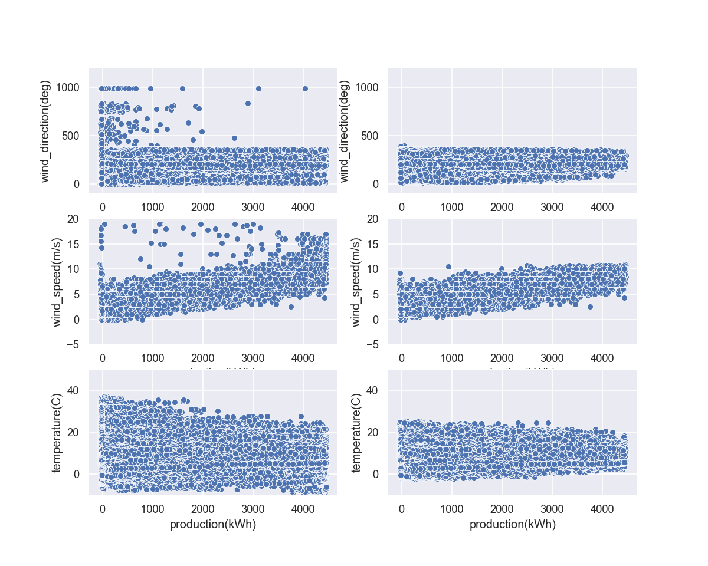
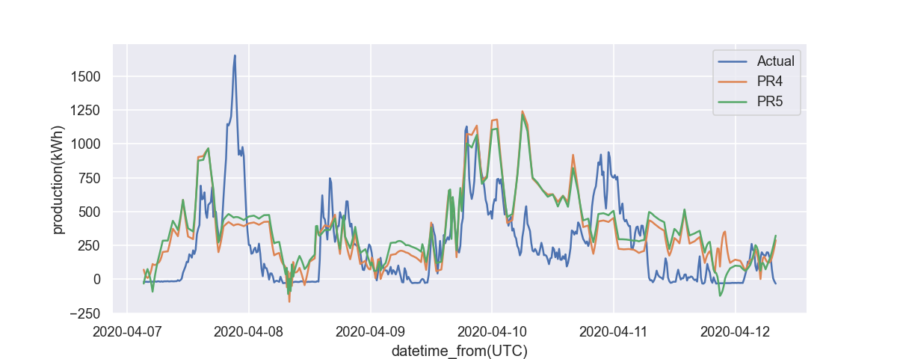
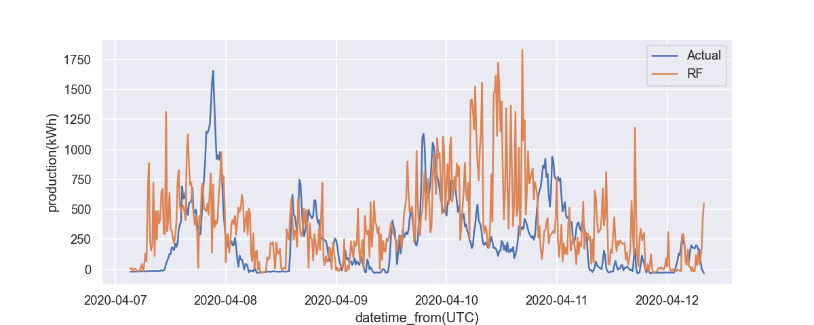

# Read Me

These are the results and my thought process over the [Data Scientist Assignment - Supply Forecasting](Data_Scientist_Assignment_Supply_Forecasting.pdf) Task

The code is available in an interactive [Juypter Notebook](eda.ipynb) in this repository. The requirements to run the notebook can be installed with `pip install  -r requirements.txt`.

The models are saved in the `models/`-folder

---

## Thoughts

Initially I wanted to try out an ARIMA model, as that was what I heard about being the known and established machine learning model for timeseries forecasting. However, evaluating the data by plotting the rolling mean and standard deviation and conducting the Augment Dickey Fuller-test, showed that the data was not stationary, nor was I able to get the data in the 15-minute resolution stationary by applying any scalings, like logarithm or logarithmic shifts to the production(kWh) data.

Next to ARIMA, I skimmed through ["Developing a Forecasting Model for the Power Production of Wind Turbines" by Mike Hesselink (University of Twente)](https://essay.utwente.nl/74895/1/Hesselink_MA_BMS.pdf), where Polynomial Regression models (4th and 5th grade) were well performing day-ahead-forecasting models. 

The recommended parameters windspeed, wind direction, and temperature were  available in the provided datasets. To match the production-data resolution I resampled the data from an hourly resolution to a 15-minute resolution by interpolating the values inbetween the available timestamps. 

According to the Pearson correlation Matrix (see in Data Visualization of the Notebook), other factors, like raditation and mist, appeared to correlate to the Production-data as well, for simplicity I wanted to focus on the recommended parameters from the paper though. I tried scaling the features with scikit's `MinMaxScaler` and `StandardScaler` but couldn't see any improvements there.

And additionally to the Polynomial Regression, I was curious how a Random Forest Regression would perform, since I read about Random Forest Regression being applicable for timeseries forecasting. Without much hyperparameter tuning, the Random Forest Regressor was not able to outperform the Polynomial Regression Models.

Below you see error metrics and side-by-side comparison plots of some test-data, that I held out from the training data set.

## Error Metrics

| Random Forest Regression | with outlier removal | without  outlier removal |
--- | --- |--- |
| MSE |  214136.452 | 306658.299 |
| RMSE |  462.749   |  553.767   |
| MAE |  329.425      | 368.29      |

| Polynomial Regression (4th) | with outlier removal | without  outlier removal |
--- | --- |--- |
| MSE |  156680.999 |241361.411   |
| RMSE | 395.83 |   491.285  |
| MAE |  287.305 |   334.43  |

| Polynomial Regression (5th) | with outlier removal | without  outlier removal |
--- | --- |--- |
| MSE |  156842.723 |240081.078     |  
| RMSE |  396.034 |   489.981   |  
| MAE |  287.079 |    331.055 |  

The outliers I removed with scikit's IsolationForest model. Their removal improved the performance (measured in the error metrics) between 10% and 15%.

 And while some data points (especially 0 production during high wind speed -> indicator maybe that the turbines were just turned off) could be considered outliers, I think the (untuned) IsolationForest was considering outliers quite agressively and could use some fine-tuning. Below you see the datapoints before (right) and after (left) the outlier removal.

## Prediction vs. Actual (snippet)

Below here, you see a visualization of how the models' predictions performed in contrast to the actual production data. 

